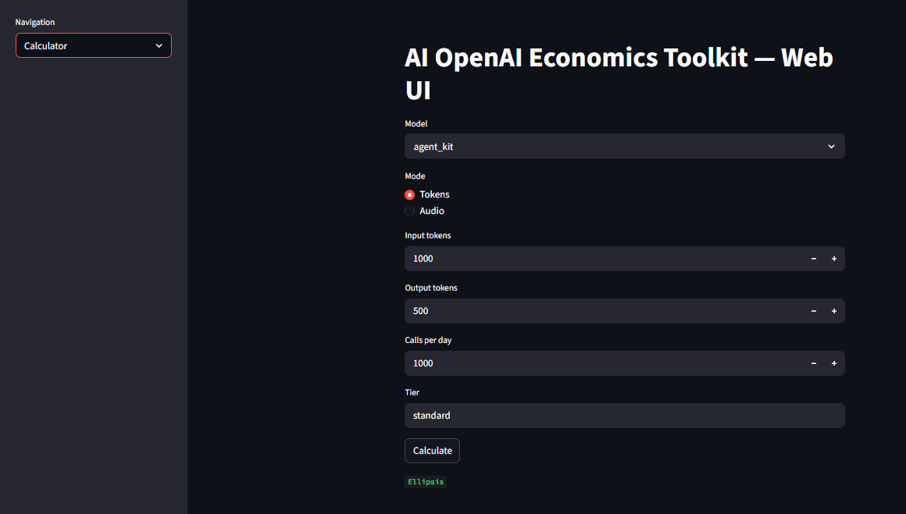
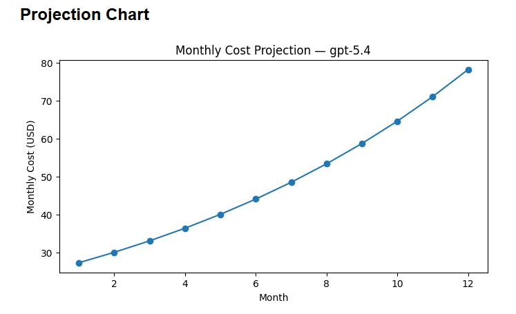
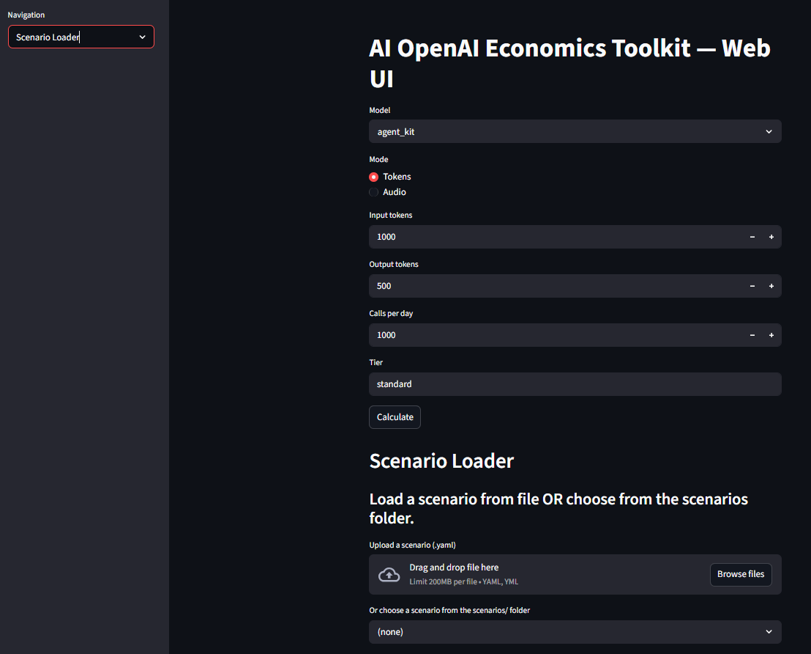
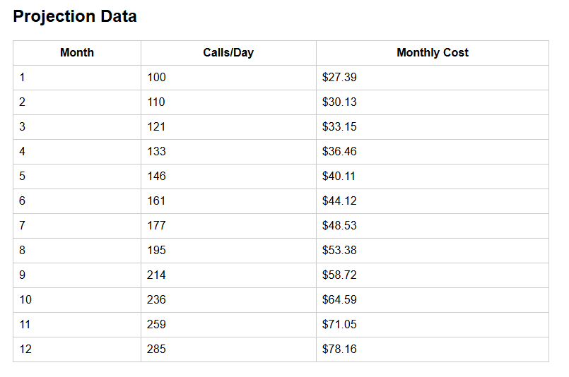

# Web UI (Streamlit)

The AI OpenAI Economics Toolkit includes a full **Streamlit Web UI** that provides an interactive way to explore model costs, run scenarios, and visualize projections.

The Web UI includes:

- A **Cost Calculator**
- A **Scenario Loader** (upload or browse)
- Interactive charts
- Automatic projection tables
- YAML scenario support

---

## 🚀 Launching the Web UI

From the project root:

```PowerShell
streamlit run webui/app.py

This opens the dashboard in your browser at:

```text
http://localhost:8501

```

## Features

- Cost calculator
- Scenario loader (upload or browse)
- Projection charts
- Projection tables
- Multi-model comparison

## 🧮 Calculator Page



The Calculator page lets you quickly estimate:

- Per‑call cost
- Daily cost
- Monthly cost
- Growth projections

### Charts



#### Inputs

- Model — any model defined in your pricing JSON 
- Mode — Tokens or Audio 
- Input tokens 
- Output tokens 
- Calls per day 
- Tier (standard, batch, etc.)

#### Outputs

- Per‑call cost
- Daily cost
- Monthly cost
- Growth projection chart
- Projection table

This is ideal for quick “what‑if” analysis.

## 📁 Scenario Loader Page



The Scenario Loader supports two ways to load scenarios:

### ✔ Option A — Upload a YAML file

You can upload any .yaml or .yml file that follows the toolkit’s scenario format:

```yaml
model: gpt-5.4
tier: standard

usage:
  input_tokens: 1200
  output_tokens: 400
  calls_per_day: 50000

projection:
  months: 12
  growth_rate: 0.08

```

### ✔ Option B — Browse the scenarios/ folder

The Web UI automatically scans:

```text
scenarios/
```

and lists all .yaml files for selection.

This makes it easy to maintain a library of reusable scenarios.

### ▶ Running a Scenario



After loading a scenario (via upload or folder selection), the UI displays:

- The parsed YAML configuration
- A Run Scenario button

When executed, the UI shows:

- Base Monthly Cost
- Per‑call cost
- Daily cost
- Monthly cost

Projection Table (if defined)
A month‑by‑month breakdown of:

Calls per day

Monthly cost

Projection Chart
A line chart showing cost growth over time.

🧠 Audio Scenarios
If a scenario uses:

```yaml
usage:
  mode: audio
  minutes_per_day: 10000
```

The Web UI automatically:

Detects whether the model supports audio pricing

Computes daily + monthly audio cost

Skips token‑based projections

📦 Scenario File Requirements
A valid scenario must include:

Required
model

usage block

Optional
tier

projection block

Supported usage modes
Token mode

```yaml
usage:
  input_tokens: 1200
  output_tokens: 400
  calls_per_day: 50000

```


```yaml
usage:
  mode: audio
  minutes_per_day: 10000

```

🧭 Navigation
The Web UI includes a sidebar navigation menu:

Calculator

Scenario Loader

More pages (dashboards, API explorer) can be added later.

🛠 Architecture
The Web UI is built from two modules:

webui/app.py
Main Streamlit application with navigation.

webui/scenario_loader.py

Implements:

File upload

Folder browsing

YAML parsing

Scenario execution

Charts + tables

## 🎯 Summary
The Web UI provides a fast, visual, interactive way to:

Explore model economics

Run complex scenarios

Visualize growth

Compare workloads

Share results